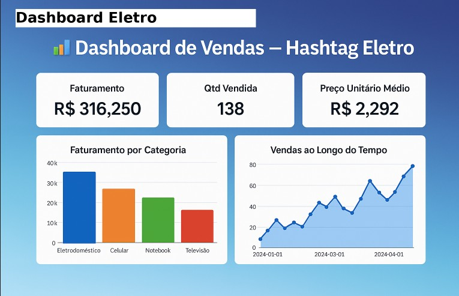

# 📊 Dashboard  Eletro

<p align="center">
  
</p>
> Dashboard interativo para análise de vendas da ** Eletro**, desenvolvido em **Python + Streamlit + Plotly**. Permite **upload da planilha** e gera automaticamente **KPIs, gráficos e filtros**. Inclui **modo demonstração** para visualização imediata sem necessidade de arquivo.

---

## ✨ Principais Recursos
- Upload do arquivo **`Base Vendas.xlsx`** direto no navegador
- **Tratamento automático** da data exportada pelo Excel (serial numérico → data válida)
- KPIs: **Faturamento Total, Quantidade Total Vendida, Ticket Médio, Total de Vendas**
- Gráficos interativos:
  - **Faturamento por mês** (linha do tempo)
  - **Faturamento por loja**
  - **Faturamento por tipo de loja** (Física vs. Online)
  - **Quantidade vendida por marca**
- **Filtros** por Data, Produto, Marca, Loja e Categoria
- **Download** dos dados filtrados em CSV
- **Modo Demo**: se nenhum arquivo for enviado, mostra uma base de exemplo


## 🗂️ Dicionário de Dados (colunas esperadas)
| Coluna            | Tipo              | Descrição                                                    |
|-------------------|-------------------|--------------------------------------------------------------|
| SKU Vendido       | Texto             | Código do produto vendido                                    |
| Qtd Vendida       | Inteiro           | Quantidade de unidades vendidas                              |
| Produto           | Texto             | Nome do produto                                              |
| Marca             | Texto             | Marca do produto                                             |
| Categoria         | Texto             | Categoria do produto (ex.: Celular, Televisão etc.)          |
| Preço Unitário    | Inteiro           | Preço por unidade do produto                                 |
| Faturamento       | Decimal           | Receita total (Qtd Vendida × Preço Unitário)                 |
| Loja              | Texto             | Cidade onde a venda foi realizada                            |
| Data da Venda     | Data              | **CRÍTICO**: Excel exporta como número serial (ex: 44928)    |
| Tipo Loja         | Texto             | Física ou Online                                             |
| Código Cliente    | Inteiro           | Identificador do cliente                                     |


---

## 🚀 Como rodar **localmente**
1. Crie e ative um ambiente virtual (opcional, porém recomendado).
2. Instale as dependências:
   ```bash
   pip install -r requirements.txt
   ```
3. Rode o app:
   ```bash
   streamlit run dashboard_hashtag_eletro.py
   ```
4. O navegador abrirá com a interface para **upload** do arquivo.


# 🧪 Base de Exemplo
O projeto inclui um arquivo `Base_Vendas_Exemplo.xlsx` com estrutura idêntica à esperada, útil para testes rápidos.

---


## 🧰 Stack Técnica
- **Python** 3.9+
- **Streamlit**
- **Pandas**
- **Plotly**
- **OpenPyXL**

<p align="center"><em>Desenvolvido por Tatiana Kami — Desenvolvedora Python & Analista de Dados</em></p>


## 📄 Licença
Este projeto é distribuído sob a licença MIT. Sinta-se à vontade para usar e adaptar internamente.
